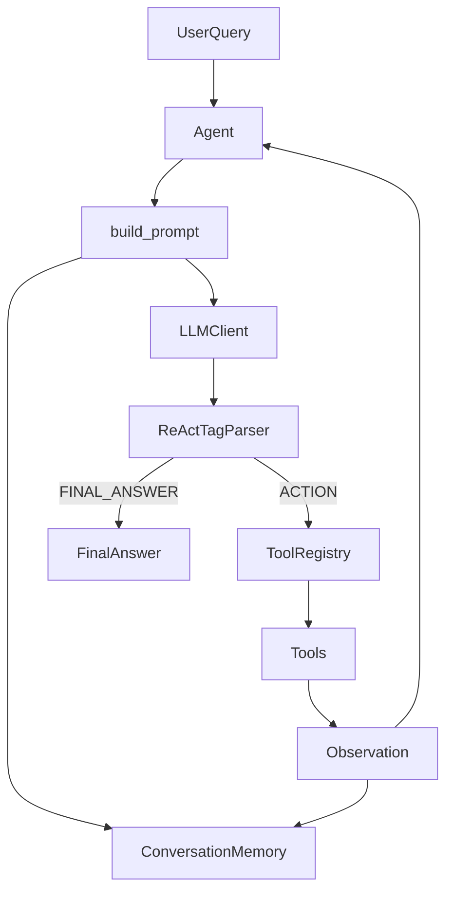

# Architecture

**Related:** [Getting Started](GETTING_STARTED.md) · [API Reference](API_REFERENCE.md) · [Security](SECURITY.md)

MaxxAgentFramework is a modular Python library for building **stateful, tool-using agents** with a explicit ReAct-style control loop. It is designed to be backend-agnostic: you bring the LLM (Hugging Face, OpenAI, or a custom HTTP endpoint such as your own Maxx model server).

## Package map

```text
maxxa_agent/
├── core/           # Agent loop, tools, memory, config
├── backends/       # LLM client implementations
├── multi_agent/    # Crew, Task, Orchestrator
├── rag/            # Document loading, chunking, retrieval
├── execution/      # Sandboxed Python execution
└── tools/          # Advanced tool pack (files, RAG, rate-limited search)
```

| Package | Responsibility |
|---------|----------------|
| `core` | ReAct agent, tool registry, conversation memory |
| `backends` | `LLMClient` protocol + HF / OpenAI / custom HTTP |
| `multi_agent` | Multiple specialized agents + coordination patterns |
| `rag` | Load/split documents, embed, semantic search |
| `execution` | Subprocess-isolated Python runner |
| `tools` | Optional advanced tools wired into `ToolRegistry` |

## High-level data flow

```text
User query
    │
    ▼
┌─────────────┐     build_prompt()      ┌──────────────────┐
│    Agent    │ ──────────────────────► │ ConversationMemory│
└─────────────┘                         └──────────────────┘
    │                                              ▲
    │ generate(prompt)                             │ append observations
    ▼                                              │
┌─────────────┐     parse tags                    │
│  LLMClient  │ ─────────────────► THOUGHT / ACTION / FINAL_ANSWER
└─────────────┘
    │
    │ ACTION (JSON tool call)
    ▼
┌─────────────┐     validate + run    ┌─────────────┐
│ToolRegistry │ ────────────────────► │  ToolResult │
└─────────────┘                       └─────────────┘
    │
    └──► loop until FINAL_ANSWER or max_steps
```



## ReAct reasoning loop (Implemented)

The `Agent` in `maxxa_agent/core/agent.py` implements a **tag-based ReAct loop**:

1. Append the user message to memory.
2. Build a plain-text prompt: system prompt + memory blocks + user query + format instructions.
3. Call `llm.generate(prompt)`.
4. Parse the model output for blocks: `[THOUGHT]`, `[ACTION]`, `[OBSERVATION]`, `[FINAL_ANSWER]`.
5. If `[FINAL_ANSWER]` is present → return it.
6. If `[ACTION]` is present → parse JSON `{"tool": "...", "args": {...}}`, run the tool, append observation to memory, repeat.
7. Stop when final answer is found or `max_steps` is exceeded.

### Expected model format

```text
[THOUGHT] Reasoning about what to do next.
[ACTION] {"tool": "read_url", "args": {"url": "https://example.com"}}
```

After the framework runs the tool, the **next** model turn should eventually produce:

```text
[FINAL_ANSWER] The answer for the user.
```

> **Note:** The framework injects tool results into memory as `[OBSERVATION]` JSON; the model does not need to author `[OBSERVATION]` blocks itself.

### Observability

**Implemented:** `Agent.run_trace()` returns a `RunTrace` with per-step `StepLog` entries (prompt, raw output, thought, action, observation).

## Tool calling pipeline (Implemented)

Tools are defined with `ToolSpec` and executed through `ToolRegistry`:

1. **Registration** — `registry.register(ToolSpec(...))` or `ToolRegistry.with_builtins()`.
2. **Validation** — arguments validated against JSON Schema (Draft 2020-12) via `jsonschema`.
3. **Safety gates** — dangerous tools require `ToolRunOptions.allow_dangerous_tools=True`.
4. **Execution** — handler returns `ToolResult` (never raises for normal tool failures).
5. **Observation** — `ToolResult.to_json()` stored in memory for the next LLM step.

### Tool packs

| Pack | Module | Tools |
|------|--------|-------|
| Built-in | `core.tools` | `read_url`, `web_search`, `file_ops`, `code_execution` |
| Advanced | `tools.advanced_tools` | `read_file`, `write_file`, `list_files`, `execute_code`, `web_search` (rate-limited), `query_knowledge_base` |

Avoid registering duplicate names in the same registry.

## Memory management (Implemented)

`ConversationMemory` stores `Message` objects (role, content, timestamp, metadata).

- **Context window** — `context_messages()` returns the last N messages (default 5, configurable via `MemoryConfig.window_size`).
- **Prompt blocks** — `to_prompt_blocks()` serializes memory for `build_prompt()`, optionally prefixing a rolling `[SUMMARY]` if summarization ran.
- **Summarization hook** — **Implemented but optional:** pass a `summarizer(messages) -> str` callable; when message count exceeds `summary_trigger_count`, older messages (outside the window) are summarized.

Memory is **in-process only** (no persistence in v0.1).

## LLM backends (Implemented)

All backends implement the `LLMClient` protocol:

```python
def generate(self, prompt: str, *, temperature=0.2, max_tokens=None, stop=None, extra=None) -> str
```

| Client | Use case |
|--------|----------|
| `CustomEndpointClient` | Your Maxx server or any HTTP JSON API |
| `HFInferenceClient` | Hugging Face Inference API |
| `OpenAIClient` | OpenAI (optional `pip install -e ".[openai]"`) |

**Partial:** `BackendConfig.name` is metadata only; you must instantiate the client yourself and pass it to `Agent`.

## Multi-agent layer (Implemented)

- **`AgentDefinition`** — wraps a core `Agent` with `name` and `role`.
- **`Crew`** — holds agents, runs `Task` objects, optional `delegate` tool injection.
- **`Orchestrator`** — coordination patterns:
  - `run_sequential` — A → B → C with optional `prior_results` context
  - `run_parallel` — concurrent tasks + aggregation
  - `run_hierarchical` — subtasks + manager synthesis task
  - `run_reactive` — policy spawns new tasks from results

See [Advanced Topics](ADVANCED_TOPICS.md) for delegation and handoffs.

## RAG pipeline (Implemented, in-memory)

```text
DocumentLoader / Document
        │
        ▼
   TextSplitter → DocumentChunk[]
        │
        ▼
   Embedder (default: LocalHashEmbedder)
        │
        ▼
   InMemoryVectorStore
        │
        ▼
   Retriever.query() → ranked hits
```

**Partial:** Agents do not auto-query the knowledge base before each step. Wire `query_knowledge_base` via `register_advanced_tools()` and/or pre-fetch context into the prompt manually.

**Planned:** persistent indices, database loaders, production embedders (see [Roadmap](ROADMAP.md)).

## Code execution (Implemented, subprocess)

`SandboxedPythonExecutor` runs `python -I -c <code>` with:

- configurable timeout
- cwd restricted to `workspace_root`
- stdout/stderr capture and truncation

This is **not** a container sandbox. See [Security](SECURITY.md).

## Error handling strategy

| Layer | Behavior |
|-------|----------|
| Tool validation | Returns `ToolResult` with `INVALID_ARGS` status |
| Tool handler exception | Captured → `ERROR` status in `ToolResult` |
| Agent parse failure | Raises `AgentParseError` |
| Tool error in loop | Agent **continues** (model may recover on next step) |
| Max steps | Raises `RuntimeError` |
| LLM backend | Raises `LLMBackendError` |

## Extensibility points

| Extension | How |
|-----------|-----|
| Custom tool | Implement handler → `ToolSpec` → `registry.register()` |
| Custom LLM | Any object with `generate(prompt, ...) -> str` matching `LLMClient` |
| Custom embedder | Implement `embed(texts) -> list[list[float]]` |
| Custom aggregator | Pass `aggregator` to `Orchestrator` |
| Custom memory | Subclass or wrap `ConversationMemory` (no formal plugin API yet) |

## What is not in v0.1

Documented on the [Roadmap](ROADMAP.md): parser auto-repair, cost tracking, async API, CLI, HTTP server, vector persistence, Docker sandbox, automated test suite.
